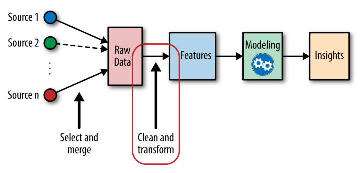

# Project 2: Feature Engineering

The overall goal of this project is to take the data that we downloaded from APIs/Web Requests and begin cleaning and organizing said data. As an overview of the total machine learning process we are between raw data and features.

We need to clean and transform the raw data that we have into useable variables that we will then use to train and test our machine learning model. So, what does that mean? Well not all data points are numbers, not all data sources always have entries for every single period we need and not all data is good data. We must take whatever we get from the raw source and make it useable for us. There is a course in datacamp for this as well if you want to follow that:

[Feature Engineering for Machine Learning in Python](https://www.datacamp.com/courses/feature-engineering-for-machine-learning-in-python?utm_source=google&utm_medium=paid_search&utm_campaignid=898687156&utm_adgroupid=150708303240&utm_device=c&utm_keyword=&utm_matchtype=&utm_network=g&utm_adpostion=&utm_creative=691706205045&utm_targetid=dsa-2220136287253&utm_loc_interest_ms=&utm_loc_physical_ms=9001335&utm_content=dsa~generic~courses~python&utm_campaign=220808_1-sea~dsa~generic_2-b2c_3-row-p1_4-prc_5-na_6-na_7-le_8-pdsh-go_9-na_10-na_11-na-feb24&gad_source=1&gclid=CjwKCAiA_5WvBhBAEiwAZtCU7x3fowqt8koC3xj5PdQRJ33MzH4Wd5Dx82F8EjRnlFO_BZHgdUfyExoCwF8QAvD_BwE)

Since we are dealing with annualized data, the date is important in terms of time of year. Sometimes these time periods that we look at are different than a 365.25 day cycle. The most obvious one that comes to mind in this context is the life of a well, which we usually have a time zero, which is start of production (or drilling) and some time horizon we are looking at to evaluate the well (10/20/30 years).

For this task, we will be taking all of the data that we have, let's go back 20 years, so start at 2003 and end at 2023 for our data collection. Each year will be a separate data set, so organize accordingly, most likely a pandas dataframe or dictionary will be the easiest for now. This dataframe or dictionary will then have one entry in it for each feature that we will be using. The feature list is as follows:

1. Price of Natural Gas (float)
2. Mean Temp (°C) (float)
3. Spd of Max Gust (km/h) (float)
4. Total Precip (mm) (float) - will intrinsicly tell us how sunny it was
5. Public Holiday in Alberta (binary)
6. Month and Day of the year
7. albertaInternalLoad from AESO (float)
8. the pool price rolling 30 day average. This can be found in the AESO pool price API response (float)
9. Previous day's pool price (float)

There are a couple of gotchyas in there. First of all, a lot of the values will come as strings instead of floats, please convert them to floats for storage. Second, there won't always be values for everyday of the year, in Python and many other languages these values will either be blank or nan/null (not a number), please replace these values with the average of surrounding days. 

You will also have one output, which is the price of electricity or the pool_price from AESO.

Your two dataframes/dicts (one for the inputs and the other for the outputs) will look something like this

YEAR || Month || Day || Price of Natural Gas || Mean Temp || Speed of Max Gust || Total Percipitation || Public Holiday || albertaInternalLoad || pool price rolling 30 day average || previous day's price

and for the outputs

YEAR || Month || Day || Pool Price

Where we then have one row entry for each column defined above. A good basic reference for some of this work [Can be found here.](https://www.learndatasci.com/tutorials/intro-feature-engineering-machine-learning-python/)

